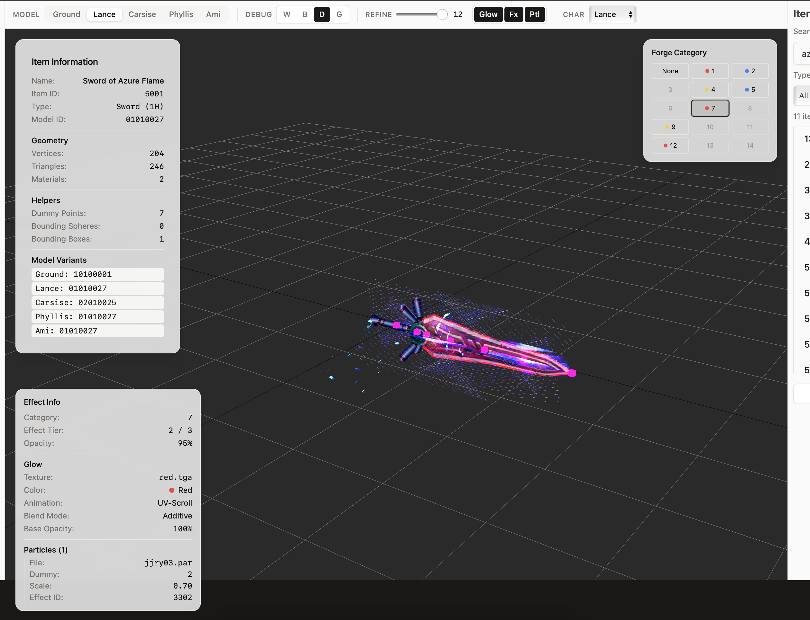
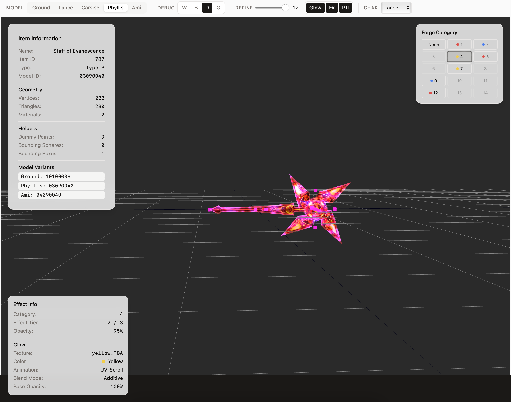
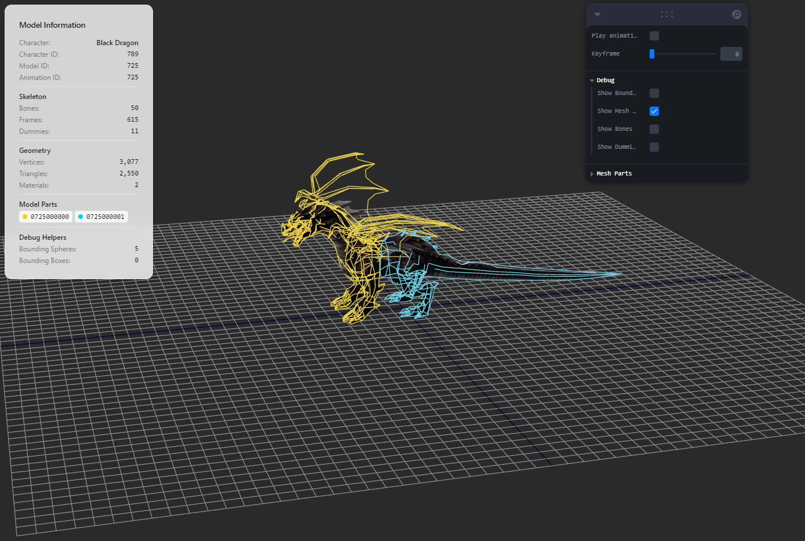
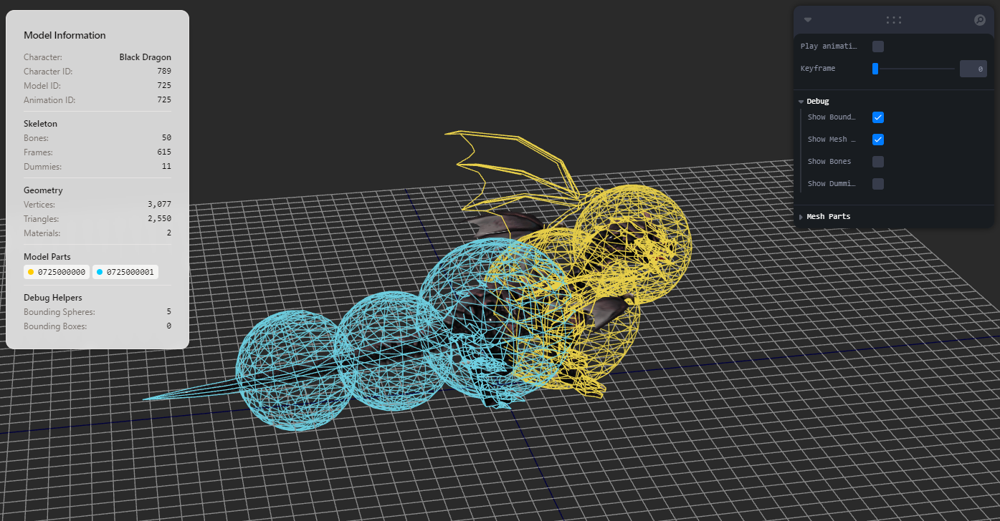
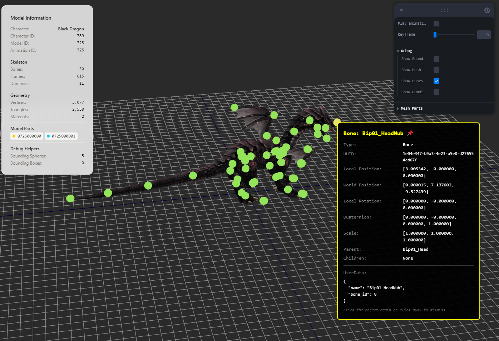

# Changelog

## [0.1.3] - 2025-02-03

### Features & Improvements

#### Effect Editor

**Full Effect Editing Workspace:**
- New effects workspace with 3D viewport, timeline, and property panels
- Edit sub-effect keyframe properties (position, rotation, scale, color)
- Edit sub-effect blend modes, billboard settings, and texture assignments
- Per-frame texture animation (EFFECT_FRAMETEX) and UV animation (EFFECT_MODELUV, EFFECT_MODELTEXTURE) preview
- Texture loading with TGA/DDS/BMP support and extension fallback
- Save/discard workflow with dirty state tracking and unsaved-changes prompt
- Save As dialog for exporting to new files

https://github.com/user-attachments/assets/c69ac8f9-3317-4aef-8cfc-56ee08d06cea

#### Item Viewer Overhaul

**New Toolbar UI:**
- Replaced floating Leva debug panel with a fixed toolbar at the top of the item viewer
- Model variant selector (Ground/Lance/Carsise/Phyllis/Ami) moved from sidebar to toolbar as segmented tabs
- Debug toggles (Wireframe, Bounding Spheres, Dummies, Glow Overlay) grouped with labeled sections
- Effect controls (Refine Level slider, Glow/Effects/Particles toggles, Character Type selector) integrated into toolbar

**Debug Overlays (Character Viewer Parity):**
- Bounding sphere wireframe indicators at static positions
- Wireframe mesh highlights using EdgesGeometry overlays
- Dummy point helpers with hover/click info tooltips showing position, rotation, and userData
- Glow overlay visualization toggle with semi-transparent green debug material

**Item Import from glTF:**
- New Import button in the item navigator sidebar
- Import glTF files to reconstruct .lgo model and .bmp texture files
- Glow overlay mesh (subset 1) correctly merged back into the .lgo format
- PKO texture encoding/decoding for round-trip compatibility

#### Forge Effect Rendering Fixes

**Lit Glow Rendering (Game-Accurate):**
- Rewrote UV animation shader to match game engine's ItemLitAnim.cpp keyframe data exactly
- Fixed UV rotation center: now rotates around UV origin (0,0) matching D3D9 texture-coordinate transform convention, instead of (0.5, 0.5)
- Fixed animation types 3/4 axis swap: type 3 now correctly scrolls V (not U), type 4 scrolls U (not V)
- Added missing animation type 2 (120-frame UV position scroll)
- Fixed all animation speeds to match 30fps game timing (120f=4s, 360f=12s, 720f=24s) — previous speeds were 3-12x too fast
- Fixed type 7 reverse rotation direction
- Fixed opacity: use lit entry's opacity directly instead of multiplying by refine alpha (the game only applies refine alpha to .eff/.par effects, not the lit glow)
- Fixed blend mode: transp_type 0 (FILTER) now correctly uses NormalBlending (SrcAlpha + InvSrcAlpha), not AdditiveBlending

**Effect Rendering:**
- Fixed D3D9-to-Three.js blend factor mapping — 6 of 10 D3DBLEND enum values were mapped incorrectly
- Fixed effect texture wrapping to RepeatWrapping matching game's D3DTADDRESS_WRAP
- Added texture-ready guard: effects with unloaded textures render as invisible instead of solid white/colored shapes
- Frame texture (EFFECT_FRAMETEX) now resolves initial texture from frameTexNames[0]

**Transform Fixes:**
- Fixed double-rotation bug affecting dummy click targets, info overlays, and effect/particle positions — world matrices now computed relative to scene root to avoid applying the Y-up rotation group twice

#### Item Workspace

**Forge Effect Preview:**
- Category-based forge effect selection with per-item availability checking
- Lit glow, 3D effect (.eff), and particle (.par) preview with forge alpha control
- Refine level slider (0-12) with tier-based lit entry selection
- Character type selector for character-specific effect variants

https://github.com/user-attachments/assets/2a33c180-cabe-4281-bd2b-186fbb5bf8ef

---

## [0.1.2] - 2025-01-13

### Features & Improvements

#### Import/Export Fixes

**Critical Bug Fixes:**
- **Fixed mesh index data type mismatch** - Import now correctly handles both U16 and U32 index formats, previously all mesh topology was broken during round-trip conversion
- **Fixed bone hierarchy import** - Parent relationships now use correct bone array positions instead of glTF node indices
- **Fixed inverse bind matrix matching** - IBMs now correctly match to bones via original node index tracking
- **Fixed animation frame count** - Frame calculation now includes endpoint (+1), fixing off-by-one frame loss
- **Fixed quaternion interpolation** - Animation now accounts for quaternion double cover (q and -q equivalence) ensuring shortest rotation path

**Multi-Part Model Support:**
- Fixed multi-part models (like Black Dragon with 2 mesh parts) - all parts now correctly export and import
- Bounding spheres now preserve their mesh association during round-trip conversion
- Model parts display correctly in metadata panel with their LGO file IDs

**Other Import/Export Improvements:**
- LAB version information now preserved during round-trip (was previously hardcoded)
- Dummy node IDs correctly extracted from glTF extras (was using node index instead)
- Vertex element sequence now properly populated during glTF import
- TextureInfo uses correct invalid type marker (0xFFFFFFFF instead of 0x7FFFFFFF)

#### Model Viewer

**New Debug Visualization:**
- **"Show Mesh Outlines" toggle** - Display colored wireframe overlay to distinguish mesh parts
- **Per-mesh visibility controls** - Toggle individual mesh parts on/off (appears when model has multiple parts)
- **Color-coded bounding spheres** - Spheres now colored by their associated mesh (8-color palette)
- **Scaled debug helpers** - Bone and dummy indicators now scale with model size (~1.5% of model dimensions)
- **Improved helper visibility** - Bones and dummies now render on top of mesh (no longer hidden behind geometry)

**Character Metadata Panel:**
- New panel showing model information at top-left of viewer
- Displays: character name/ID, model ID, animation ID
- Shows skeleton info: bone count, frame count, dummy count
- Shows geometry info: vertex count, triangle count, material count
- Lists model parts with colored indicators
- Shows debug helper counts (bounding spheres, boxes)

#### Removed
- Removed "Ghost Mesh Opacity" slider (no longer needed since helpers render on top)

#### Known Issues
- Toggling debug helpers (bones, dummies, mesh outlines) in certain orders may cause rendering issues - will be fixed in next update

---

### Internal

#### Testing

**New Test Suites:**
- `model_088_roundtrip_test.rs` - Comprehensive LAB+LGO round-trip tests for Attendant model (38 bones, 888 vertices)
- `model_725_black_dragon_test.rs` - Multi-part model tests for Black Dragon (2 mesh parts, 50 bones)
- `hierarchy_tests.rs` - Bone hierarchy validation
- `index_space_tests.rs` - Index space consistency tests
- `skinning_tests.rs` - Skeletal skinning tests
- `byte_equality_test.rs` - Binary comparison tests
- `struct_comparison_test.rs` - Struct field comparison tests

**Test Fixtures Added:**
- Known-good LAB files: 0000.lab, 0001.lab, 0002.lab, 0003.lab, 0088.lab, 0725.lab
- Known-good LGO files: Multiple character model parts (0000-0003 series, 0088, 0725)
- Known-good glTF exports: 1.gltf through 4.gltf, 789.gltf
- Test textures: 0088000000.bmp, 0725000000.bmp

**Test Coverage:**
- LAB round-trip: bones, animation frames, dummies, inverse bind matrices
- LGO round-trip: vertices, indices, materials, textures, bounding spheres
- Mesh header bone fields, vertex element sequences, texture info fields
- Helper data (bounding spheres, boxes, dummies)

#### Tooling

**Claude Code Skills:**
- `tdd` - Test-Driven Development guidance for Rust backend and TypeScript frontend
- `pko-client-reference` - Reference guide for PKO game client source code validation
- `skill-creator` - Tools for creating new Claude Code skills

#### Code Quality
- Added PartialEq/Eq derives to ColorKeyType, TextureType, D3DVertexElement9 enums
- Made D3DVertexElement9 fields public for test access
- Made animation, character, mesh modules public for testing
- Added original_node_index field to LwBoneBaseInfo for IBM matching
- New `MeshHighlights.tsx` component for wireframe overlays
- New `Card` UI component
- Configurable helper size constants (BONE_HELPER_SCALE_PERCENT, etc.)
