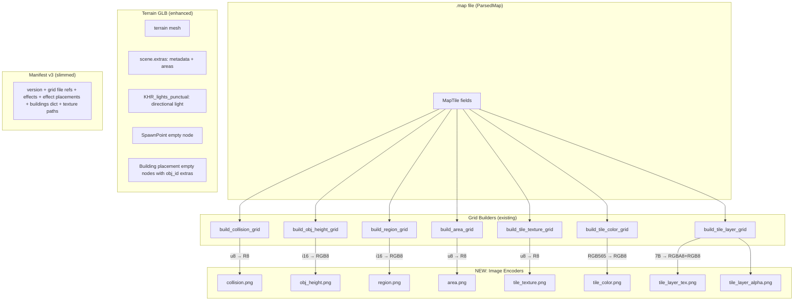
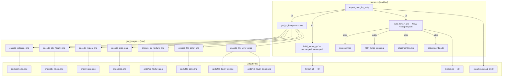

# Feature Plan: Grid Image Export + Manifest Slim-Down

**Date:** 2026-02-16
**Status:** Draft
**Branch:** `feat/grid-image-export`

## Summary

Replace the 7 binary `.bin` grid sidecar files with PNG images, move spatial/scene metadata from `manifest.json` into the terrain GLB's `scene.extras` and `KHR_lights_punctual`, and slim the manifest down to just file references and game-logic data (effects, buildings dict, texture paths). The goal is human-debuggable grids, zero custom binary parsers on the Unity side, and a self-describing terrain GLB. Support both v2 (legacy binary) and v3 (image) output via a format version flag.

## Data Flow



## Research Findings

### Existing Code Audit

| File | Relevance | Notes |
|------|-----------|-------|
| `src-tauri/src/map/terrain.rs` | Primary | All 7 `build_*_grid` fns (lines 1107-1258), `export_map_for_unity` (line 1343), manifest builder (line 1612), `build_terrain_gltf` (line 314) |
| `src-tauri/src/map/texture.rs` | High | `build_tile_layer_grid` (line 501), `unpack_tile_layers` (line 101), `ALPHA_NO_2_UV` table (line 128) |
| `src-tauri/src/map/area_set.rs` | Medium | `AreaDefinition` struct (line 9), `areas_to_json` (line 183) |
| `src-tauri/src/map/mod.rs` | Medium | Module root — add `pub mod grid_images; pub mod glb;`, add `ExportOptions` struct. `MapForUnityExportResult` field names unchanged (grid image paths live in manifest.json, not the command result) |
| `src-tauri/src/bin/export_cli.rs` | Medium | CLI entry point — needs `--format v2\|v3` flag parsing (positional args: `<client_dir> <output_dir> <map_name>`). Line 38 prints `result.terrain_gltf_path` — this still works since the field name is unchanged, but the printed label should say "Terrain:" instead of "Terrain glTF:" when v3 |
| `src-tauri/Cargo.toml` | High | `image = "0.25.5"` already available with PNG support |

### Format Analysis

**Current grid outputs (all raw binary, row-major Y-outer X-inner):**

| Grid | Resolution | Bytes/Cell | Encoding | Size (256x256 map) |
|------|-----------|-----------|----------|-------------------|
| collision | 2x (512x512) | 1 | u8: 0 or 1 | 256 KB |
| obj_height | 2x (512x512) | 2 | i16 LE millimeters | 512 KB |
| region | 1x (256x256) | 2 | i16 LE bitmask | 128 KB |
| area | 1x (256x256) | 1 | u8 area ID | 64 KB |
| tile_texture | 1x (256x256) | 1 | u8 texture ID | 64 KB |
| tile_color | 1x (256x256) | 2 | i16 RGB565 | 128 KB |
| tile_layer | 1x (256x256) | 7 | [base,L1t,L1a,L2t,L2a,L3t,L3a] | 448 KB |

**Proposed image outputs:**

| Grid | PNG Format | Channels | Encoding Strategy |
|------|-----------|----------|-------------------|
| collision | Grayscale (R8) | 1 | Source 0 (walkable) → pixel 0, source 1 (blocked) → pixel 255. Decode contract: pixel < 128 = walkable, pixel >= 128 = blocked. Visually: black=walkable, white=blocked. |
| obj_height | RGB8 | 3 | i16 split into R=low byte, G=high byte, B=0 (unsigned offset +32768). See below. |
| region | RGB8 | 3 | i16 split into R=low byte, G=high byte, B=0 (unsigned offset +32768) |
| area | Grayscale (R8) | 1 | Direct u8 value as pixel intensity |
| tile_texture | Grayscale (R8) | 1 | Direct u8 value as pixel intensity |
| tile_color | RGB8 | 3 | Pre-decode RGB565→RGB8 at export. Visually meaningful. |
| tile_layer_tex | RGBA8 | 4 | R=base_tex, G=L1_tex, B=L2_tex, A=L3_tex |
| tile_layer_alpha | RGB8 | 3 | R=L1_alpha, G=L2_alpha, B=L3_alpha |

### i16 Encoding Strategy

Unity has poor native support for 16-bit PNG. Instead of fighting this, we encode i16 values into **two channels of an RGB8 PNG** (B channel unused, set to 0). We use RGB8 — not grayscale+alpha — because PNG has no true RG color type; "2-channel PNG" is grayscale+alpha, where the alpha channel has different semantics and some tools/importers treat it specially.

```
Export (Rust — writes RGB8 PNG):
  u16_val = (i16_val as i32 + 32768) as u16    // shift to unsigned
  R = (u16_val & 0xFF) as u8                    // low byte
  G = (u16_val >> 8) as u8                      // high byte
  B = 0                                          // unused

Import (Unity C# — reads RGB8 texture):
  Color32 pixel = texture.GetPixel32(x, y);
  int raw = pixel.r + pixel.g * 256;            // reconstruct u16
  short value = (short)(raw - 32768);           // shift back to signed
```

This uses only universally-supported 8-bit RGB PNG channels. No R16, no EXR, no RAW format. Every grid is a standard 8-bit PNG that any tool can open. The B=0 channel wastes ~33% space on the i16 grids, but these are small (region grid for a 256x256 map = 192KB as RGB8 vs 128KB as raw binary — acceptable).

### Reference Code

- **PKO client source**: `MPTile.h` (btBlock bit encoding), `MPMapData.cpp` (sColor RGB565 conversion), `CompCommand.h` (sRegion bitmask flags)
- **Rust `image` crate**: `GrayImage` for R8, `RgbImage` for RGB8, `RgbaImage` for RGBA8 — all support `.save()` to PNG
- **glTF spec**: `scene.extras` for arbitrary JSON, `KHR_lights_punctual` for directional lights, node instancing (multiple nodes → same mesh)
- **Unity glTFast 6.0+**: Supports `KHR_lights_punctual` natively, supports `extras` via Add-on API

## Architecture



### New Modules/Files

| File | Purpose |
|------|---------|
| `src-tauri/src/map/grid_images.rs` | All grid-to-PNG encoding functions. One public fn per grid type + one `encode_all_grids` orchestrator. |
| `src-tauri/src/map/glb.rs` | `write_glb(json, bin, path)` utility — GLB container writer (header + JSON chunk + BIN chunk with alignment padding). |

### Modified Files

| File | Changes |
|------|---------|
| `src-tauri/src/map/terrain.rs` | `export_map_for_unity`: accept `ExportOptions`, branch v2/v3. Add new `build_terrain_glb()` for v3 path (raw buffer collection + scene extras + KHR_lights_punctual + placement nodes). Existing `build_terrain_gltf` unchanged (viewer path still returns JSON string). `batch_export_for_unity`: accept and forward `ExportOptions`. |
| `src-tauri/src/map/scene_model.rs` | Add new `build_glb_from_lmo()` alongside existing `build_gltf_from_lmo`. New fn returns `(String, Vec<u8>)` for GLB writing. Existing `build_gltf_from_lmo` unchanged — viewer commands (`load_building_model` at commands.rs:129, `export_building_to_gltf` at commands.rs:150) still call it and get JSON string back. |
| `src-tauri/src/map/mod.rs` | Add `pub mod grid_images; pub mod glb;`. Add `ExportOptions` struct + `Default` impl. `MapForUnityExportResult` and `BuildingExportEntry` field names stay unchanged — `terrain_gltf_path` and `gltf_path` continue to work for both `.gltf` (v2) and `.glb` (v3) since they hold a file path regardless of extension. Renaming is deferred until v2 is removed. |
| `src-tauri/src/map/texture.rs` | No changes — `build_tile_layer_grid` output is consumed by new encoder. |
| `src-tauri/src/bin/export_cli.rs` | Parse optional `--format v2\|v3` after positional args. Build `ExportOptions`, pass to `export_map_for_unity`. |
| `src-tauri/src/map/commands.rs` | `export_map_for_unity` Tauri command (line 56): add optional `format` param, build `ExportOptions`. `batch_export_maps_for_unity` (line 76): same. Viewer commands (`load_map_terrain` line 18, `load_building_model` line 129, `export_building_to_gltf` line 150) untouched. |
| `src/commands/map.ts` | `exportMapForUnity` (line 31): add optional `format` param, pass through to invoke. |
| `src/types/map.ts` | No field renames needed — `terrain_gltf_path`, `gltf_path`, and `building_gltf_paths` keep their current names. They hold file paths regardless of extension (.gltf for v2, .glb for v3). Renaming is deferred until v2 is dropped. No changes needed in this file for v3 support. |

## Pitfalls & Mitigations

| Risk | Impact | Mitigation |
|------|--------|------------|
| **Row order mismatch**: PNG row 0 = top, Unity `GetPixel` y=0 = bottom | High — every grid lookup off by (height-1-y) | Document the convention: images are exported with PKO Y=0 at top (same as PNG). Unity importer flips Y on read. Add a unit test that round-trips a known grid through PNG encode→decode and verifies specific cell values. |
| **i16 encoding precision loss** | High — wrong region bitmask or height value | No precision loss: i16 has 65536 values, two 8-bit channels give 256×256=65536 values. Exact 1:1 mapping via RGB8 (R=lo, G=hi, B=0). B channel wastes space but avoids grayscale+alpha ambiguity. Add round-trip test. |
| **sRGB gamma on Unity import** | High — Unity applies gamma to PNG by default, corrupting index values | Document that all grid PNGs must be imported with `sRGBTexture=false`, `compression=None`, `filterMode=Point`. Provide sample `AssetPostprocessor` script. Consider naming convention (`*_data.png`) for auto-detection. |
| **PNG compression changes values** | Med — PNG is lossless, but validate | PNG is lossless by spec. No risk here. The `image` crate writes standard compliant PNGs. |
| **Large manifest extras in glTF** | Med — 500 placements × ~100 bytes each = ~50KB of JSON in scene.extras | Acceptable. glTF extras has no size limit. 50KB is trivial vs the terrain mesh buffer. |
| **KHR_lights_punctual direction encoding** | Med — PKO stores direction vector, glTF uses node rotation with -Z as light direction | Compute quaternion that rotates -Z to the PKO light direction vector. Test with known direction (e.g., [-1,-1,-1] should produce ~45° downward light). |
| **Breaking change for existing Unity importer** | Med — anyone using current manifest v2 breaks | Bump manifest version to 3. Document changes. Current Unity importer code is in a separate project and will need updating regardless. |
| **tile_layer encoding: alpha IDs only use 0-15** | Low — values fit in 4 bits but we store in 8-bit channel | No waste — PNG channel is always 8 bits minimum. Values 0-15 stored as 0-15 in the channel. Unity reads `pixel.r` and gets the exact value. |

## Implementation Steps

### Phase 1: Grid Image Encoders

Create `src-tauri/src/map/grid_images.rs` with encoding functions.

- [ ] `encode_collision_png(grid: &[u8], w: i32, h: i32, path: &Path)` — u8 grid → R8 grayscale PNG (scale 0/1 to 0/255)
- [ ] `encode_u8_grid_png(grid: &[u8], w: i32, h: i32, path: &Path)` — generic u8 grid → R8 grayscale PNG (direct value, for area + tile_texture)
- [ ] `encode_i16_grid_png(grid: &[u8], w: i32, h: i32, path: &Path)` — i16 LE bytes → RGB8 PNG (R=low byte, G=high byte, B=0; unsigned offset +32768; for obj_height + region)
- [ ] `encode_tile_color_png(grid: &[u8], w: i32, h: i32, path: &Path)` — i16 RGB565 bytes → RGB8 PNG (decoded color)
- [ ] `encode_tile_layer_pngs(grid: &[u8], w: i32, h: i32, tex_path: &Path, alpha_path: &Path)` — 7-byte-per-tile grid → RGBA8 (tex IDs) + RGB8 (alpha IDs)
- [ ] `encode_all_grids(...)` — orchestrator that calls all of the above, returns list of output paths
- [ ] Add `pub mod grid_images;` to `src-tauri/src/map/mod.rs`
- [ ] Unit tests: round-trip each encoder with known input data, verify exact pixel values

### Phase 2: GLB Writer + Terrain/Building GLB Export

**Critical constraint:** `build_terrain_gltf` (terrain.rs:314) and `build_gltf_from_lmo` (scene_model.rs:774) both return `String` (JSON with data URIs) and are used by the **in-app viewer** APIs. These viewer paths must NOT be broken:

- `build_map_viewer_gltf` (terrain.rs:1056) → called by `load_map_terrain` Tauri command (commands.rs:18) → returns JSON string to frontend viewer
- `build_gltf_from_lmo` → called by `load_building_model` (commands.rs:129) → returns JSON string to frontend viewer
- `build_gltf_from_lmo` → called by `export_building_to_gltf` (commands.rs:150) → writes JSON .gltf file

**Strategy: new functions, not in-place swaps.** The existing `build_terrain_gltf` and `build_gltf_from_lmo` keep returning JSON strings for the viewer. New GLB-producing functions are added alongside them, used only by the Unity export v3 path.

**Phase 2a: GLB writer utility**
- [ ] Add `write_glb(json_str: &str, bin_data: &[u8], path: &Path) -> Result<()>` utility (in a new `src-tauri/src/map/glb.rs` or in `grid_images.rs`)
- [ ] GLB format: 12-byte header (magic `0x46546C67`, version 2, total length) + JSON chunk (padded to 4-byte alignment with spaces) + BIN chunk (padded with `\0`)

**Phase 2b: Terrain GLB builder (new function)**
- [ ] Add `build_terrain_glb(parsed_map, atlas, unity_metadata) -> Result<(String, Vec<u8>)>` that returns (JSON string, binary buffer) instead of a single JSON string with data URIs
- [ ] Internally: collect all buffer data as raw `Vec<u8>` segments, collect atlas JPEG bytes as raw, build buffer views with byte offsets, reference images via `bufferView` instead of data URIs
- [ ] Scene metadata (v3 only): `scene.extras` with map metadata + areas dict, `KHR_lights_punctual` directional light, `SpawnPoint` empty node, building placement empty nodes with extras `{ "obj_id", "source_glb" }`
- [ ] The existing `build_terrain_gltf` remains unchanged — viewer path still returns JSON string

**Phase 2c: Building GLB builder (new function)**
- [ ] Add `build_glb_from_lmo(lmo_path, project_dir) -> Result<(String, Vec<u8>)>` alongside existing `build_gltf_from_lmo`
- [ ] Same pattern: raw buffer collection, bufferView references, no data URIs
- [ ] Reuse the existing mesh/material/animation building logic — factor it into shared internals if practical, or duplicate the final serialization step
- [ ] `export_map_for_unity` v3 path (terrain.rs:1420) calls `build_glb_from_lmo` + `write_glb` instead of `build_gltf_from_lmo` + string write
- [ ] Existing viewer call sites untouched:
  - `load_building_model` (commands.rs:129) → still calls `build_gltf_from_lmo` → returns String
  - `export_building_to_gltf` (commands.rs:150) → still calls `build_gltf_from_lmo` → writes .gltf

**Scene metadata enhancements (added to terrain GLB only, v3 path):**
- [ ] `scene.extras`: `version`, `map_name`, `coordinate_system`, `world_scale`, `unit_scale_contract`, `map_width_tiles`, `map_height_tiles`, `section_width`, `section_height`, `areas` dict, `ambient`, `background_color`
- [ ] `KHR_lights_punctual` extension: one directional light with `light_color` and `light_direction` (converted to node rotation quaternion; light shines along node's -Z)
- [ ] Empty node `"SpawnPoint"` with translation from `spawn_point` tile coordinates
- [ ] Empty nodes for building placements under a `"Buildings"` parent node, each with extras `{ "obj_id", "source_glb" }`
- [ ] Effect placements stay in manifest — NOT in glTF

### Phase 3: Wire Up Export + Slim Manifest + v2/v3 Flag

Add a `manifest_version` parameter to `export_map_for_unity`. Rust has no default args, so use an options struct. All call sites must be updated.

- [ ] Define options struct:
  ```rust
  pub struct ExportOptions {
      pub manifest_version: u32, // 2 or 3
  }
  impl Default for ExportOptions {
      fn default() -> Self { Self { manifest_version: 3 } }
  }
  ```
- [ ] Change `export_map_for_unity` signature: `(project_dir, map_name, output_dir, options: &ExportOptions)`
- [ ] When `manifest_version == 2`: execute existing binary write + JSON glTF code (unchanged behavior)
- [ ] When `manifest_version == 3`: call `grid_images::encode_*`, build enhanced GLB, write slim manifest
- [ ] **Update all call sites:**
  - `src-tauri/src/bin/export_cli.rs:35` — parse `--format v2|v3` from args (positional CLI, see below), pass to options. Line 38: update the print label from `"Terrain glTF:"` to `"Terrain:"` when v3 (or always — the field value already contains the correct path/extension)
  - `src-tauri/src/map/terrain.rs:1853` — `batch_export_for_unity()` calls `export_map_for_unity` in a loop; add `options` param to batch fn too, forward to each call
  - `src-tauri/src/map/commands.rs:71` — Tauri command `export_map_for_unity`; add optional `format` param, default to v3
  - `src-tauri/src/map/commands.rs:76` — Tauri command `batch_export_maps_for_unity`; same
  - `src/commands/map.ts:31` — frontend `exportMapForUnity()`; add optional `format` param to invoke call
- [ ] v3 manifest schema:
  ```json
  {
    "version": 3,
    "unit_scale_contract": "pko_1unit_to_unity_1unit_v1",
    "terrain_glb": "terrain.glb",
    "grids": {
      "collision":        { "file": "grids/collision.png",        "scale": 2, "format": "u8_threshold128", "decode": "pixel < 128 = walkable, >= 128 = blocked" },
      "obj_height":       { "file": "grids/obj_height.png",       "scale": 2, "format": "i16_rgb8_offset" },
      "region":           { "file": "grids/region.png",           "scale": 1, "format": "i16_rgb8_offset" },
      "area":             { "file": "grids/area.png",             "scale": 1, "format": "u8_direct" },
      "tile_texture":     { "file": "grids/tile_texture.png",     "scale": 1, "format": "u8_direct" },
      "tile_color":       { "file": "grids/tile_color.png",       "scale": 1, "format": "rgb8_color" },
      "tile_layer_tex":   { "file": "grids/tile_layer_tex.png",   "scale": 1, "format": "rgba8_indices" },
      "tile_layer_alpha": { "file": "grids/tile_layer_alpha.png", "scale": 1, "format": "rgb8_indices" }
    },
    "buildings": { "<obj_id>": { "glb": "buildings/<stem>.glb", "filename": "..." } },
    "effect_placements": [ { "eff_id", "position", "rotation_y_degrees", "scale" } ],
    "effect_definitions": { ... } | "effect_definitions_file": "effect_definitions.json",
    "missing_effect_ids": [...],
    "water_textures": [...],
    "terrain_textures": { ... },
    "alpha_atlas": "terrain_textures/alpha_atlas.png"
  }
  ```
  Grid metadata rationale: `scale` distinguishes 2x sub-tile grids (collision, obj_height) from 1x tile grids without requiring hardcoded importer knowledge. `format` tells the importer how to decode pixel values without guessing. Image dimensions come from the PNG header. This is minimal but self-describing.
- [ ] Removed from manifest (now in terrain.glb scene extras): `map_name`, `coordinate_system`, `world_scale`, `map_width_tiles`, `map_height_tiles`, `section_width`, `section_height`, `placements` (building placements), `spawn_point`, `light_direction`, `light_color`, `ambient`, `background_color`, `areas`
- [ ] Kept in manifest: `effect_placements` (alongside effect definitions — all effect data in one place)
- [ ] `MapForUnityExportResult` field names stay unchanged (`terrain_gltf_path`, `gltf_path`, `building_gltf_paths`). The v3 code path populates them with `.glb` paths instead of `.gltf` — the field names are generic enough. Rename deferred until v2 removal.
- [ ] Run `cargo clippy` and fix warnings

### Phase 4: Testing & Verification

- [ ] Run `cargo test` — all existing tests pass
- [ ] Export xmas map with v3 (default): `cargo run --bin export_cli -- <client_dir> <output_dir> 07xmas`
- [ ] Export xmas map with v2: `cargo run --bin export_cli -- <client_dir> <output_dir> 07xmas --format v2` (verify legacy still works)
  Note: CLI uses positional args `<client_dir> <output_dir> <map_name>` (existing shape). The `--format` flag is appended optionally.
- [ ] Verify v3 output directory has `.png` files in `grids/` and `terrain.glb` instead of `terrain.gltf`
- [ ] Open each grid PNG in an image viewer — visually inspect (collision should look like a map outline, tile_color should show baked lighting, area should show distinct zone blobs)
- [ ] Open `terrain.glb` in a glTF viewer (e.g., https://gltf-viewer.donmccurdy.com/) — verify scene extras, KHR_lights_punctual light, placement nodes, SpawnPoint node
- [ ] Verify manifest.json is v3 and significantly smaller than v2
- [ ] Spot-check a few pixel values against known tile data (e.g., a known blocked tile should be pixel 255 in collision.png)

## Testing Strategy

### Unit Tests (grid_images.rs)
- [ ] For each encoder, create a small known grid (e.g., 4x4), encode to PNG in a temp file, decode back using the `image` crate, verify every pixel matches the expected value. This catches encoding bugs and row-order issues.
- [ ] **i16 round-trip**: Encode known i16 values (-32768, -1, 0, 1, 32767, specific region bitmasks like 0x0007) through the RGB8 encoding, decode R+G*256-32768, verify exact match.
- [ ] **RGB565 round-trip**: Encode known RGB565 values, decode to RGB8, verify channels match the PKO engine's `LW_RGB565TODWORD` output.

### Manifest Schema Contract Tests
- [ ] **v2 schema contract test**: Export a small synthetic map with `manifest_version=2`, deserialize manifest JSON, assert all expected v2 keys exist (`collision_grid.width`, `collision_grid.file`, `placements`, `light_direction`, etc.). Snapshot the key set.
- [ ] **v3 schema contract test**: Export same synthetic map with `manifest_version=3`, deserialize manifest JSON, assert all expected v3 keys exist (`grids.collision.file`, `grids.collision.scale`, `grids.collision.format`, `effect_placements`, `terrain_glb`, etc.) and v2-only keys are absent (`placements`, `light_direction`, `collision_grid`, etc.).
- [ ] **Terrain GLB validity test**: For v3 output, verify `terrain.glb` starts with the GLB magic bytes (`0x46546C67`), has valid JSON chunk, and scene extras contain expected keys. Additionally assert v3-critical scene nodes exist: a node named `"SpawnPoint"` with a translation, and that `extensionsUsed` includes `"KHR_lights_punctual"` with at least one light defined. If the test fixture has building placements, also assert a `"Buildings"` parent node exists with at least one child carrying `obj_id` in extras; skip this check for maps with zero placements.
- [ ] **Building GLB validity test**: For v3 output, export at least one building via `build_glb_from_lmo`, verify GLB magic bytes, valid JSON chunk, at least one mesh present. Smoke-test round-trip: write GLB, read back JSON chunk, assert node count > 0.
- [ ] Both contract tests run in CI so regressions to either schema are caught automatically.

### Integration Tests
- [ ] Export a real map (e.g., xmas) with both v2 and v3, verify output directory structure matches expectations.
- [ ] Check PNG dimensions match grid resolution (e.g., collision PNG width = map_width * 2).
- [ ] **Manifest-to-file consistency**: After v3 export, parse `manifest.json`, iterate every `buildings[*].glb` path, and assert each resolves to an existing file on disk relative to the output directory. Catches stale references or path construction bugs.

### Manual Verification
- [ ] Open grid PNGs in an image viewer. Collision map should clearly show walkable areas vs blocked areas as black/white shapes. Tile color should look like a lightmap. Area grid should show distinct zone blobs.
- [ ] Open `terrain.glb` in a glTF viewer — verify scene extras, light node, placement nodes.

## Resolved Decisions

- [x] **Effect placements**: Stay in manifest alongside effect definitions. Rationale: effects are game-logic data (particle systems); the Unity importer needs both positions and definitions together. Buildings go in glTF because they're renderable 3D assets.
- [x] **Backward compatibility**: v2/v3 flag on `export_map_for_unity` and CLI `--format v2|v3`. Default v3. Existing v2 code path preserved.
- [x] **GLB vs glTF**: The **Unity export path** (v3) switches to `.glb` for both terrain and buildings. The **in-app viewer** and **export-to-gltf command** stay on JSON `.gltf` — existing `build_terrain_gltf` and `build_gltf_from_lmo` are untouched. New `build_terrain_glb` and `build_glb_from_lmo` functions are added alongside them.
