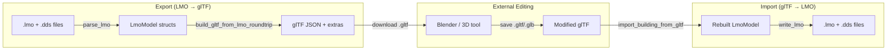
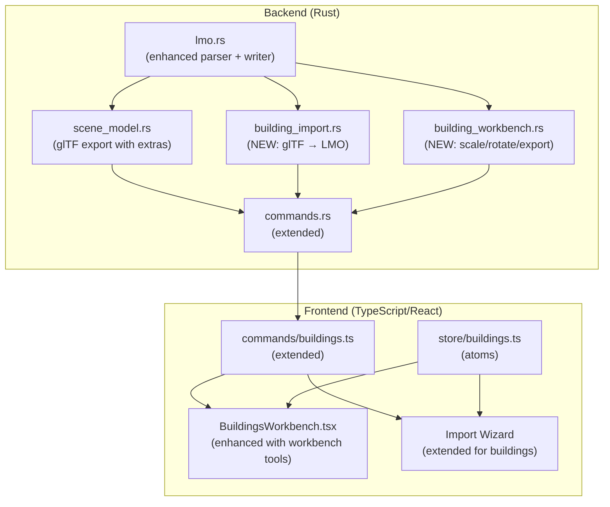

# Feature Plan: LMO Building Round-Trip (Import/Export)

**Date:** 2026-02-12
**Status:** Draft
**Branch:** `feat/lmo-round-trip`

## Summary

Full round-trip pipeline for PKO building assets: LMO+DDS → glTF → LMO+DDS. Buildings can be exported to glTF for editing in Blender/external tools, then re-imported back to the PKO LMO format with all critical data preserved via glTF extras. Includes comprehensive Rust backend tests and TypeScript frontend tests.

## Data Flow



## Research Findings

### Existing Code Audit

| File | Relevance | Notes |
|------|-----------|-------|
| `src-tauri/src/map/lmo.rs` | **Critical** | Full LMO binary parser (read-only). Supports v0, v0x1004, v0x1005. Parses materials, mesh, animation. Decomposes 4×3 matrix keyframes into translation+quaternion. **Missing: no writer.** |
| `src-tauri/src/map/scene_model.rs` | **Critical** | LMO → glTF export. `build_gltf_from_lmo` produces standalone glTF with embedded textures. `GltfBuilder` helper handles buffers/accessors. **Missing: no PKO extras stored — cannot round-trip.** |
| `src-tauri/src/item/model.rs` | **Analogue** | Item LGO round-trip pipeline. `PkoModelExtras` + `PkoMaterialExtras` pattern stores all D3D render state in glTF extras. `import_item_from_gltf` reconstructs LGO binary from glTF. This is the template to follow. |
| `src-tauri/src/map/commands.rs` | **Extend** | Has `load_building_model`, `export_building_to_gltf`, `get_building_list`. Needs `import_building_from_gltf` and `export_building_to_gltf_roundtrip` commands. |
| `src/commands/buildings.ts` | **Extend** | Frontend wrappers for building commands. Needs import command. |
| `src/features/buildings/` | **Extend** | Building viewer exists (`BuildingsWorkbench`). Needs import wizard integration and export-for-editing button. |
| PKO client: `lwExpObj.cpp` | **Reference** | C++ Save/Load implementations. Confirms: header → geom_object table → per-object (header 116B → mtl → mesh → helper → anim). Sizes pre-computed in header. |

### Format Analysis

**LMO Binary Layout (v0x1005):**
```
[4] version (0x1005)
[4] obj_num
[obj_num × 12] header table: { type(4), addr(4), size(4) }

Per geometry object at addr:
  [116] GeomObjHeader:
    id(4) + parent_id(4) + type(4) + mat_local(64) +
    rcci(16) + state_ctrl(8) + mtl_size(4) + mesh_size(4) +
    helper_size(4) + anim_size(4)
  [mtl_size] Materials:
    mtl_num(4) + N × { opacity(4) + transp(4) + lwMaterial(68) +
    rs_set(96) + tex_seq[4](4 × 224) }
  [mesh_size] Mesh:
    fvf(4) + pt_type(4) + vertex_num(4) + index_num(4) +
    subset_num(4) + bone_index_num(4) + bone_infl_factor(4) +
    vertex_element_num(4) + rs_set(96) +
    positions + normals + texcoords + colors + indices + subsets
  [helper_size] Helpers (pass-through blob)
  [anim_size] Animation:
    data_bone_size(4) + data_mat_size(4) +
    mtlopac_sizes[16](64) + texuv_sizes[16][4](256) +
    teximg_sizes[16][4](256) +
    matrix_anim: frame_num(4) + frames[N](48 bytes each)
```

**Key differences from LGO (items):**
1. LMO supports **multiple geometry objects** per file (LGO has one)
2. LMO has **matrix animation** per geom object (spinning lights, rotating parts)
3. LMO uses **DDS textures** primarily (LGO uses BMP)
4. LMO has **no glow overlay convention** (that's item-specific)
5. LMO geom objects have **parent_id** for hierarchy (parent-child transforms)
6. Version 0 files have different material layouts (V0000, V0001)

**Data currently discarded by parser (must preserve for round-trip):**
- `rcci` (16 bytes) — render control create info
- `state_ctrl` (8 bytes) — state control
- Material `specular`, `emissive`, `power` — skipped with `seek`
- Material `transp_type` — read but not stored
- Material render state atoms (`rs_set`) — skipped
- Per-texture: `stage`, `level`, `usage`, `format`, `pool`, `byte_alignment_flag`, `type`, `width`, `height`, `colorkey_type`, `colorkey`, `data`, `tss_set` — all skipped
- Mesh render state atoms — skipped
- Mesh `fvf`, `pt_type`, `bone_infl_factor`, `vertex_element_num` — not stored
- Helper section — entirely skipped
- Animation raw bytes (only decomposed translation/rotation stored)
- Material format version info for re-serialization

### Reference Code

| Source | Purpose |
|--------|---------|
| `lwExpObj.cpp:Save()` | Confirms write order: version → count → headers → per-obj data |
| `lwExpObj.cpp:lwSaveMtlTexInfo()` | Material serialization with version-specific sizes |
| `lwExpObj.cpp:lwMeshInfo_Save()` | Mesh serialization: header → vertex_elements → verts → normals → UVs → colors → blend → indices → subsets |
| `lwExpObj.cpp:lwAnimDataInfo::Save()` | Animation: size headers → bone → mat → mtlopac → texuv → teximg |
| `item/model.rs:import_item_from_gltf()` | Pattern for: glTF extras → binary size computation → assembly → write |

## Architecture



### New Modules/Files

| File | Purpose |
|------|---------|
| `src-tauri/src/map/building_import.rs` | `import_building_from_gltf()` — reads glTF, extracts extras, writes LMO binary + textures. Analogous to `item/model.rs:import_item_from_gltf()`. |
| `src-tauri/src/map/lmo_writer.rs` | `write_lmo()` — serialize `LmoModel` to binary bytes. Computes section sizes, writes header table, per-object data. |
| `src-tauri/src/map/building_workbench.rs` | Building workbench operations: rescale, rotate, export to game directory. Follows `item/workbench.rs` pattern. SQLite persistence for workbench state. |
| `src/features/buildings/__tests__/buildingImport.test.ts` | Frontend tests for building import flow. |
| `src/features/buildings/__tests__/buildingWorkbench.test.ts` | Frontend tests for building workbench UI. |

### Modified Files

| File | Changes |
|------|---------|
| `src-tauri/src/map/lmo.rs` | Enhance `LmoGeomObject` and `LmoMaterial` structs to store ALL raw fields needed for round-trip (rcci, state_ctrl, full material data, mesh render state, fvf, helper blob, raw animation blob). Add serde derives. |
| `src-tauri/src/map/scene_model.rs` | Add `PkoLmoExtras` / `PkoLmoMaterialExtras` structs (like item pipeline). `build_gltf_from_lmo_roundtrip()` writes extras into glTF nodes/meshes. Keep existing `build_gltf_from_lmo()` for viewer (no extras needed). |
| `src-tauri/src/map/commands.rs` | Add `import_building_from_gltf` and `export_building_for_editing` Tauri commands. |
| `src-tauri/src/map/mod.rs` | Add `pub mod building_import; pub mod lmo_writer; pub mod building_workbench;`. Add `BuildingImportResult` struct. |
| `src/commands/buildings.ts` | Add `importBuildingFromGltf()`, workbench commands (rescale, rotate, export). |
| `src/features/import/ImportWizard.tsx` | Extend to handle `importType: "building"`. |
| `src/features/buildings/BuildingsWorkbench.tsx` | Enhance with workbench toolbar: scale/rotate controls, export button, "Open Workbench" post-import flow. |
| `src/store/buildings.ts` | Add import + workbench atoms (active workbench, scale/rotation state). |
| `src/types/buildings.ts` | Add `BuildingImportResult`, `BuildingWorkbenchState` types. |

## Pitfalls & Mitigations

| Risk | Impact | Mitigation |
|------|--------|------------|
| **LMO parser discards critical data** — rcci, state_ctrl, render states, texture metadata all skipped in current parser | **High** — Cannot write back valid LMO without these | Enhance `LmoGeomObject` and `LmoMaterial` structs to store all raw fields. Store opaque byte blobs where full deserialization isn't needed (e.g., `rcci: [u8; 16]`, `helper_blob: Vec<u8>`). |
| **Multi-geometry objects with parent hierarchy** — LMOs can have multiple geom objects referencing each other via parent_id | **High** — glTF export must preserve object identity and hierarchy | Store each geom object as a separate glTF node with `pko_lmo_geom` extras. Preserve `id` and `parent_id` in extras. Rebuild hierarchy on import. |
| **Version 0 material format** — V0000/V0001 have different sizes than current format | **Med** — Re-exporting v0 files as v0x1005 may alter behavior | Always write as v0x1005 (current version). Document that old-format files get "upgraded" on round-trip. This matches how the game engine would re-save them. |
| **Animation data fidelity** — Current parser decomposes 4×3 matrices to translation+quaternion, losing scale and potential skew | **Med** — Recomposed matrices may differ from originals | Store raw animation blob as pass-through bytes for round-trip. Only decompose for glTF visualization (which is already working). On import, use raw blob if present in extras, otherwise recompose from glTF animation tracks. |
| **DDS texture round-trip** — DDS files use DXT1/3/5 compression. Re-encoding requires choosing matching format | **Med** — Wrong compression = visual artifacts or alpha loss | On export: detect DDS format and store in extras. On import: if modified texture is PNG/BMP, encode to DDS using the original format stored in extras. If same DDS file unchanged, copy bytes directly. |
| **Coordinate system double-transform** — Export applies Z-up→Y-up. Import must reverse Y-up→Z-up exactly | **Med** — Accumulating floating-point error on round-trip | Use exact inverse: `(gx, gy, gz) → (gx, -gz, gy)`. Test with known coordinates to verify exact round-trip. |
| **mat_local baked into vertices** — Current export bakes mat_local into vertex positions for non-animated objects | **High** — Cannot recover original mat_local + untransformed vertices | For round-trip export: do NOT bake mat_local. Store it in extras and apply as a glTF node transform instead. Keep the baking behavior for the viewer path. |
| **Helper section** — Current parser skips helpers entirely | **Med** — Buildings with helper data (bounding boxes, etc.) lose it | Store as opaque byte blob (`helper_blob: Vec<u8>`). Pass through on round-trip. No need to parse unless we want to display helpers. |
| **Texture path normalization** — PKO uses backslashes, file search is case-insensitive | **Low** — Import may write wrong path format | Normalize texture paths to PKO convention (backslash, original casing from extras). |
| **Large model memory** — Some buildings have many geom objects with large meshes | **Low** — Memory pressure during conversion | Stream processing where possible. LMO files are typically <10MB. |

## Implementation Steps

### Phase 1: Enhanced LMO Parser (Store All Data)

- [ ] **1.1** Extend `LmoGeomObject` struct to store: `rcci: [u8; 16]`, `state_ctrl: [u8; 8]`, `fvf: u32`, `pt_type: u32`, `bone_infl_factor: u32`, `vertex_element_num: u32`, `mesh_rs_set: Vec<u8>`, `helper_blob: Vec<u8>`, `raw_anim_blob: Vec<u8>`
- [ ] **1.2** Extend `LmoMaterial` to store ALL fields: `transp_type: u32`, `specular: [f32; 4]`, `emissive: [f32; 4]`, `power: f32`, `rs_set: Vec<u8>`, `tex_infos: [LmoTexInfo; 4]` (with all D3D metadata)
- [ ] **1.3** Create `LmoTexInfo` struct: `stage`, `level`, `usage`, `d3d_format`, `pool`, `byte_alignment_flag`, `tex_type`, `width`, `height`, `colorkey_type`, `colorkey`, `filename`, `data`, `tss_set: Vec<u8>`
- [ ] **1.4** Update `parse_lmo()` to populate all new fields instead of `seek`-skipping them
- [ ] **1.5** Store helper section as raw byte blob (read `helper_size` bytes into `helper_blob`)
- [ ] **1.6** Store animation section as raw byte blob (read `anim_size` bytes into `raw_anim_blob`) alongside the decomposed translation/rotation for glTF visualization
- [ ] **1.7** Store `mtl_format_version` on `LmoGeomObject` so writer knows original format
- [ ] **1.8** Add `#[derive(Serialize, Deserialize)]` to all LMO structs that go into extras
- [ ] **1.9** Run existing tests — all must still pass

### Phase 2: LMO Writer

- [ ] **2.1** Create `src-tauri/src/map/lmo_writer.rs` with `write_lmo(model: &LmoModel) -> Vec<u8>`
- [ ] **2.2** Implement header table computation: count geom objects, pre-compute per-object sizes, calculate addresses
- [ ] **2.3** Implement per-geom-object writer: header (116B) → materials → mesh → helpers → animation
- [ ] **2.4** Material writer: always write v0x1005/MTLTEX_VERSION0002 format (opacity + transp + material(68) + rs_set(96) + tex_seq[4](4×224))
- [ ] **2.5** Mesh writer: header (32 + 96) → vertex_elements → positions → normals → texcoords → colors → indices → subsets
- [ ] **2.6** Helper writer: write raw blob bytes
- [ ] **2.7** Animation writer: write raw blob bytes
- [ ] **2.8** Size computation functions: `compute_mtl_size()`, `compute_mesh_size()` matching C++ formulas
- [ ] **2.9** Unit test: build synthetic `LmoModel`, write, re-parse, verify all fields match
- [ ] **2.10** Round-trip test: `parse_lmo(data) → write_lmo(model) → parse_lmo(data2)` — compare models structurally

### Phase 3: Enhanced glTF Export (with PKO Extras)

- [ ] **3.1** Define `PkoLmoExtras` struct (node-level): `version`, `geom_id`, `parent_id`, `obj_type`, `mat_local`, `rcci`, `state_ctrl`, `fvf`, `pt_type`, `mesh_rs_set`, `helper_blob` (base64), `raw_anim_blob` (base64)
- [ ] **3.2** Define `PkoLmoMaterialExtras` struct (mesh-level): array of per-material extras with all material+texture fields (following `PkoMaterialExtras` pattern from item pipeline)
- [ ] **3.3** Implement `build_gltf_from_lmo_roundtrip()` — same as `build_gltf_from_lmo()` but: stores extras, does NOT bake mat_local into vertices, stores mat_local as node transform
- [ ] **3.4** Add export-for-editing Tauri command that calls the roundtrip variant and writes .gltf to disk
- [ ] **3.5** Test: export → verify extras are present in JSON → verify geometry is correct in glTF space

### Phase 4: glTF → LMO Import

- [ ] **4.1** Create `src-tauri/src/map/building_import.rs`
- [ ] **4.2** Implement `import_building_from_gltf(file_path, building_id, output_dir, scale_factor) -> BuildingImportResult`
- [ ] **4.3** Parse glTF nodes: identify building geom nodes (by `pko_lmo_geom` extras)
- [ ] **4.4** For each geom node: read vertex/normal/UV/index data from primitives
- [ ] **4.5** Reverse coordinate transform: glTF Y-up → PKO Z-up `(gx, gy, gz) → (gx, -gz, gy)`
- [ ] **4.6** Extract `PkoLmoExtras` from node extras → reconstruct header fields
- [ ] **4.7** Extract `PkoLmoMaterialExtras` from mesh extras → reconstruct materials
- [ ] **4.8** Handle textures: extract glTF images → write as DDS (or BMP if originally BMP) to output directory
- [ ] **4.9** Rebuild `LmoModel` struct from extracted data
- [ ] **4.10** Call `write_lmo()` to produce binary → write to `imports/building/<building_id>.lmo`
- [ ] **4.11** Handle "fresh import" (no PKO extras) — external model from Blender: use sensible defaults for all D3D fields, merge all meshes into single geom object
- [ ] **4.12** Return `BuildingImportResult { lmo_path, texture_paths, import_dir, building_id }`

### Phase 5: Backend Tests

- [ ] **5.1** `lmo_writer::tests` — Synthetic model write + re-parse round-trip
- [ ] **5.2** `lmo_writer::tests` — Multiple geom objects write + re-parse
- [ ] **5.3** `lmo_writer::tests` — All FVF flag combinations (normals, texcoords, colors, all, none)
- [ ] **5.4** `lmo_writer::tests` — Material with texture filename preservation
- [ ] **5.5** `lmo_writer::tests` — Empty model (0 objects) write + re-parse
- [ ] **5.6** `lmo_writer::tests` — Animation blob pass-through
- [ ] **5.7** `lmo_writer::tests` — Helper blob pass-through
- [ ] **5.8** `scene_model::tests` — Export with extras: verify PkoLmoExtras in JSON
- [ ] **5.9** `scene_model::tests` — Export with extras: verify PkoLmoMaterialExtras in JSON
- [ ] **5.10** `scene_model::tests` — Coordinate transform round-trip: Z-up→Y-up→Z-up = identity
- [ ] **5.11** `building_import::tests` — Synthetic glTF → LMO: verify geometry
- [ ] **5.12** `building_import::tests` — Synthetic glTF → LMO: verify materials
- [ ] **5.13** `building_import::tests` — Fresh import (no extras): verify defaults applied
- [ ] **5.14** `building_import::tests` — Scale factor applied to positions
- [ ] **5.15** Full round-trip test: real `.lmo` → glTF → `.lmo` → compare fields (conditional on `../top-client/`)
- [ ] **5.16** Full round-trip test: animated building (e.g., lighthouse `by-bd013`) → verify animation blob preserved
- [ ] **5.17** PkoLmoExtras serde round-trip test (serialize → deserialize → compare)
- [ ] **5.18** PkoLmoMaterialExtras backward compatibility test (missing fields → defaults)
- [ ] **5.19** `cargo clippy` clean

### Phase 6: Tauri Commands & Frontend Integration

- [ ] **6.1** Add `import_building_from_gltf` Tauri command in `commands.rs`
- [ ] **6.2** Add `export_building_for_editing` Tauri command (writes glTF with extras to exports dir)
- [ ] **6.3** Register new commands in `src-tauri/src/lib.rs`
- [ ] **6.4** Add `importBuildingFromGltf()` and `exportBuildingForEditing()` to `src/commands/buildings.ts`
- [ ] **6.5** Add `BuildingImportResult` to `src/types/buildings.ts`
- [ ] **6.6** Add "Export for Editing" button to `BuildingsWorkbench.tsx`
- [ ] **6.7** Extend `ImportWizard` to support `importType: "building"` (reuse file selection, add building-specific config: building ID + scale factor)
- [ ] **6.8** Add building import atoms to store if needed
- [ ] **6.9** Wire up navigation: import result → "View Model" or "Open Workbench"

### Phase 7: Building Workbench

- [ ] **7.1** Create `src-tauri/src/map/building_workbench.rs` — follows `item/workbench.rs` pattern
- [ ] **7.2** SQLite tables: `building_workbenches` (building_id PK, source_file, scale_factor, lmo_path, created_at)
- [ ] **7.3** Implement `rescale_building(lmo_path, factor)` — multiply all vertex positions by factor across all geom objects, regenerate glTF preview
- [ ] **7.4** Implement `rotate_building(lmo_path, x_deg, y_deg, z_deg)` — rotate vertices and normals across all geom objects, regenerate glTF preview
- [ ] **7.5** Implement `export_building(project_id, lmo_path, target_building_id)` — copy LMO to exports dir, copy/rename textures
- [ ] **7.6** Implement `save_building_workbench()` / `load_building_workbench()` — SQLite CRUD for workbench state
- [ ] **7.7** Add workbench Tauri commands: `rescale_building`, `rotate_building`, `export_building`, `save_building_workbench`, `load_building_workbench`
- [ ] **7.8** Register workbench commands in `src-tauri/src/lib.rs`
- [ ] **7.9** Add workbench command wrappers in `src/commands/buildings.ts`
- [ ] **7.10** Enhance `BuildingsWorkbench.tsx` with toolbar: scale input + apply button, rotation inputs + apply button, export button
- [ ] **7.11** Add workbench atoms in `src/store/buildings.ts`: `activeBuildingWorkbenchAtom`, `buildingWorkbenchStateAtom`
- [ ] **7.12** Add `BuildingWorkbenchState` type to `src/types/buildings.ts`
- [ ] **7.13** Unit tests for `rescale_building` — verify vertex positions scaled correctly
- [ ] **7.14** Unit tests for `rotate_building` — verify vertex positions and normals rotated correctly
- [ ] **7.15** Unit tests for `export_building` — verify files written to correct location
- [ ] **7.16** Integration test: import → open workbench → rescale → verify preview updates

### Phase 8: Frontend Tests

- [ ] **8.1** `buildingImport.test.ts` — Import wizard state transitions for building type
- [ ] **8.2** `buildingImport.test.ts` — Building import result display (lmo path, texture paths)
- [ ] **8.3** `buildingExport.test.ts` — Export-for-editing command invocation
- [ ] **8.4** `buildingTypes.test.ts` — BuildingImportResult type validation
- [ ] **8.5** `BuildingsWorkbench.test.tsx` — Export button renders when building selected
- [ ] **8.6** `BuildingsWorkbench.test.tsx` — Loading state shown during model load
- [ ] **8.7** `BuildingsWorkbench.test.tsx` — Workbench toolbar renders scale/rotate controls
- [ ] **8.8** `buildingWorkbench.test.ts` — Workbench command wrappers invoke correct Tauri commands

## Testing Strategy

### Backend (Rust)

- **Unit tests (always run):**
  - LMO writer: synthetic data → write → re-parse → field comparison
  - FVF flag combinations (8 variants)
  - Material extras serde round-trip
  - Coordinate transform inverse verification
  - Size computation matches expected byte counts

- **Integration tests (conditional on `../top-client/`):**
  - Real LMO file full round-trip: parse → export glTF → import glTF → write LMO → re-parse → compare
  - Animated building round-trip (lighthouse, whirlpool)
  - Version-0 LMO upgrade round-trip
  - DDS texture extraction and re-embedding
  - Multi-geom-object building round-trip

- **Validation points per round-trip:**
  - `geom_objects.len()` matches
  - Per geom: `id`, `parent_id`, `obj_type`, `mat_local` match
  - Per geom: `vertices.len()`, `indices.len()`, `subsets.len()` match
  - Per geom: `rcci`, `state_ctrl`, `fvf`, `mesh_rs_set` match
  - Per material: all color fields, opacity, render states match
  - Per texture: filename, D3D format, dimensions match
  - Helper blob byte-exact match
  - Animation blob byte-exact match (when using pass-through)

### Frontend (TypeScript)

- **Unit tests:**
  - Import wizard state machine for building type
  - Command wrapper type safety
  - Building import result parsing
  - Workbench command wrappers

- **Component tests:**
  - Export button visibility and click handler
  - Loading/error states in workbench
  - Workbench toolbar rendering (scale/rotate controls)
  - Workbench state transitions

### Manual Verification

- [ ] Export a PKO building → open in Blender → verify geometry and textures look correct
- [ ] Edit building in Blender → save → import back → verify in PKO viewer
- [ ] Import a fresh GLB from Blender (no PKO extras) → verify defaults work
- [ ] Animated building round-trip → verify animation plays correctly
- [ ] Multi-geom building round-trip → verify all parts present
- [ ] Workbench: rescale a building → verify preview updates → export → verify LMO file
- [ ] Workbench: rotate a building → verify preview updates → export → verify LMO file
- [ ] Run `cargo clippy` — no warnings
- [ ] Run `cargo test` — all pass
- [ ] Run `pnpm test:run` — all pass

## Decisions (Resolved)

- **DDS re-encoding**: Write BMP for simplicity — the game client accepts both formats. Store original DDS format in extras as documentation.
- **Version upgrade**: Silent upgrade from v0 → v0x1005 is acceptable. This matches how the PKO engine itself would re-save.
- **Import wizard**: Building import wizard assigns a building ID (like item import). Buildings use `sceneobjinfo.bin` registry for ID mapping.
- **Workbench**: Include building workbench in v1 with scale/rotate tools, following the item workbench pattern (`item/workbench.rs`).
