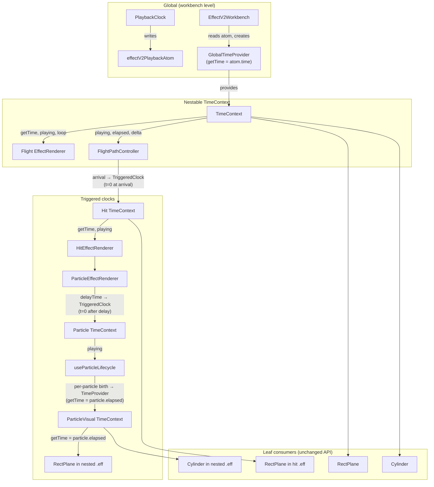
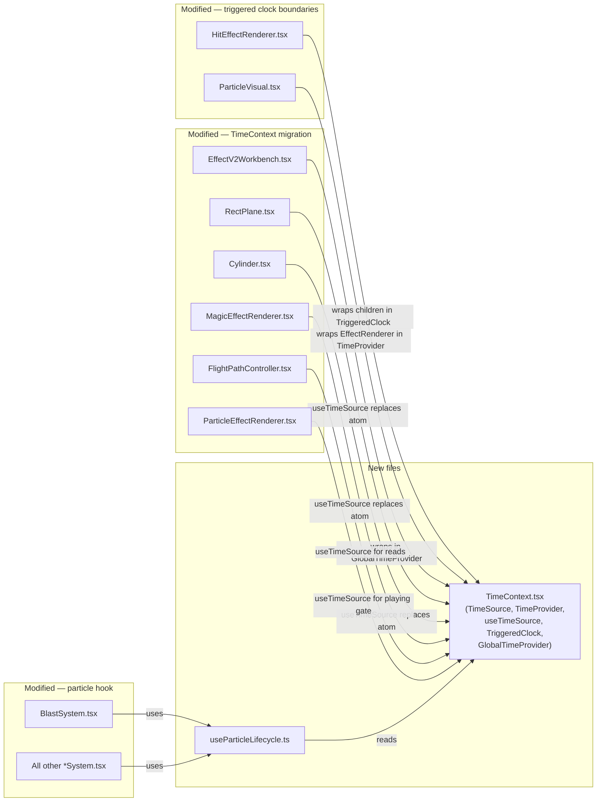

# TimeContext + useParticleLifecycle

## Summary

Introduce a nestable `TimeContext` that gives any triggered effect group its own clock starting from zero at the moment of triggering. This replaces the current pattern where every renderer reads the global `effectV2PlaybackAtom.time` directly — which breaks for anything that doesn't start at the beginning of playback (hit effects, delayed sub-effects, particle-hosted effects, loop restarts).

Separately, extract the shared particle frame advancement / interpolation / death logic (identical across all 16 PKO particle types) into a `useParticleLifecycle` hook.

## Scope

**This plan covers scaffolding only:**
- `TimeContext`, `GlobalTimeProvider`, `TriggeredClock` — new files
- Atom-to-context migration in existing consumers — mechanical swap, no logic changes
- `useParticleLifecycle` hook — shared frame/interpolation/death engine
- `ParticleVisual` local time provider wiring
- `BlastSystem` wired to the hook as first consumer (init/move callbacks only)

**Explicitly out of scope:**
- Implementing core particle physics for any system type (fire, snow, round, etc.)
- Changing any existing coordinate conversion logic (PKO XYZ → Three.js XZY via `pkoVec` stays exactly as-is)
- Changing keyframe interpolation in RectPlane/Cylinder (only the time source changes, not the math)
- Adding new rendering logic — existing sub-effect rendering stays identical

**Golden rule:** if a file already has working core logic (coordinate swaps, interpolation, blend modes), only the time-reading mechanism changes. No new transforms, no new math, no new coordinate handling.

## Problem

Every time something is *triggered* — flight arrival, delay expiring, particle birth, loop restart — the triggered thing needs a clock that starts from zero at that moment. Currently there's no mechanism for this.

```
EffectV2Workbench
  └─ PlaybackClock            → writes effectV2PlaybackAtom.time (t=0 at play)
  └─ MagicEffectRenderer
       └─ EffectRenderer
            └─ RectPlane      → reads atom.time ← CORRECT (starts with global clock)
       └─ FlightPathController
            │  (flight arrives at t=1.2s)
            └─ HitEffectRenderer
                 └─ ParticleEffectRenderer
                      └─ BlastSystem
                           └─ ParticleVisual
                                └─ EffectRenderer
                                     └─ RectPlane → reads atom.time ← WRONG
                                                    (reads 1.2+, should be 0+)
```

Broken cases today:
- **Hit effects**: spawned when flight arrives (e.g. t=1.2s), but sub-effects read global time so they start mid-animation
- **Particle nested effects**: each particle spawns at a different time, but its `.eff` reads global time instead of time-since-birth
- **Delayed sub-effects**: `delayTime` offsets when something starts, but there's no mechanism to zero the clock after the delay
- **Loop restarts**: when a particle system re-spawns a batch, nested effects should restart from 0

The correct model is nested clocks:

```
Global clock (t=0 at play)
  └─ Flight .eff sub-effects (t = global, starts at play)
  └─ Hit effect (t=0 at flight arrival)
       └─ Particle system (t=0 at hit start + delayTime)
            └─ Particle 0 (t=0 at particle birth)
            │    └─ Nested .eff (t = particle 0 elapsed)
            └─ Particle 1 (t=0 at particle birth, may differ from particle 0)
                 └─ Nested .eff (t = particle 1 elapsed)
```

## Data Flow



## Architecture



## TimeContext Design

### TimeSource interface

```ts
interface TimeSource {
  /** Current animation time in seconds (relative to this clock's zero point). */
  getTime(): number;
  /** Whether playback is active. Inherited from root — pausing pauses everything. */
  playing: boolean;
  /**
   * Whether this clock's scope should loop.
   * This is a SIGNAL read by leaf consumers — it does NOT affect getTime() behavior.
   * Leaves (RectPlane, Cylinder) are responsible for their own t % totalDuration modulo.
   */
  loop: boolean;
}
```

### Components

| Component | Purpose |
|-----------|---------|
| `TimeProvider` | Raw context provider (`TimeContext.Provider`) |
| `useTimeSource()` | Consumer hook — returns nearest `TimeSource` from context |
| `GlobalTimeProvider` | Bridges `effectV2PlaybackAtom` → `TimeSource`. Used once at workbench root. |
| `TriggeredClock` | The key primitive. Wraps children in a new `TimeProvider` whose `getTime()` returns time-since-trigger. Uses parent's `playing` to gate its own internal delta accumulation. Resets to 0 on remount. |

### TriggeredClock

This is the general-purpose component that creates a new clock boundary:

```tsx
interface TriggeredClockProps {
  loop?: boolean;
  children: ReactNode;
}

function TriggeredClock({ loop = false, children }: TriggeredClockProps) {
  const parent = useTimeSource();
  const elapsedRef = useRef(0);

  useFrame((_, delta) => {
    if (!parent.playing) return;
    elapsedRef.current += Math.min(delta, 0.05); // clamp first-frame spike
  });

  // Stable object — identity never changes, getTime reads ref.
  // NOTE: parent must also be a stable ref-based object for the
  // `get playing()` getter chain to read current values correctly.
  // The `loop` prop is captured at mount time and does not update.
  const timeSource = useRef<TimeSource>({
    getTime: () => elapsedRef.current,
    get playing() { return parent.playing; },
    loop,
  }).current;

  return <TimeProvider value={timeSource}>{children}</TimeProvider>;
}
```

**R3F useFrame ordering:** useFrame callbacks execute in mount order (FIFO). TriggeredClock's useFrame (which accumulates `elapsedRef`) runs *before* any child useFrame callbacks (which read `getTime()`), so children always see the updated time for the current frame.

**React 18 Strict Mode:** in development, effects/refs are double-invoked. `useRef(0)` re-initializes on the second mount. Verify during Phase 1 that elapsed doesn't double-accumulate.

Used at every trigger boundary:
- `HitEffectRenderer` wraps its children in `<TriggeredClock>` (starts at 0 when hit effect mounts)
- `ParticleVisual` uses a direct `<TimeProvider>` with `getTime: () => particle.elapsed` (driven by `useParticleLifecycle`)
- Future: any delayed effect group could wrap in `<TriggeredClock>` after the delay

Because `TriggeredClock` mounts when the triggering event occurs (hit effect appears, particle visual created), `elapsedRef` naturally starts at 0 at the right moment. Unmounting and remounting (loop restart) resets it.

## Consumers of `effectV2PlaybackAtom` (all must migrate)

| File | Current usage | After migration |
|------|--------------|-----------------|
| `PlaybackClock.tsx` | writes `time` via `setPlayback` | **No change** — only writer, keeps atom |
| `EffectV2Workbench.tsx` | reads for PlaybackBar UI + resets on effect switch | **No change** for UI. Adds `<GlobalTimeProvider>` wrapping Canvas children |
| `MagicEffectRenderer.tsx` | reads `playing` + `time` for target character oscillation | `useTimeSource()` |
| `FlightPathController.tsx` | reads `playing`, `time`, `loop`; writes `setPlayback` for loop restart | `useTimeSource()` for reads. Keeps `useAtom` solely for write. |
| `ParticleEffectRenderer.tsx` | reads `playing` as gate | `useTimeSource().playing` |
| `RectPlane.tsx` | reads `time`, `loop` | `useTimeSource()` — `.getTime()` and `.loop` |
| `Cylinder.tsx` | reads `time`, `loop` | `useTimeSource()` — `.getTime()` and `.loop` |
| `BlastSystem.tsx` | reads `playback` (mostly unused) | Removed — `useParticleLifecycle` reads `useTimeSource().playing` internally |

## Implementation Phases

### Phase 1: TimeContext + GlobalTimeProvider

Create `src/features/effect-v2/TimeContext.tsx`:
- `TimeSource` interface
- `TimeContext` = `createContext<TimeSource | null>(null)`
- `TimeProvider` = `TimeContext.Provider`
- `useTimeSource()` = `useContext` + throw if null
- `GlobalTimeProvider` component that reads `effectV2PlaybackAtom` and provides it as a `TimeSource` using ref-based getter
- `TriggeredClock` component (described above)

### Phase 2: Migrate atom consumers to useTimeSource

1. In `EffectV2Workbench.tsx`, wrap Canvas children in `<GlobalTimeProvider>`:
   - `PlaybackClock` stays inside Canvas but doesn't need the context (it writes the atom)
   - Everything below `PlaybackClock` gets the global `TimeSource`

2. Migrate each consumer from `useAtomValue(effectV2PlaybackAtom)` to `useTimeSource()`:
   - `playback.time` → `timeSource.getTime()`
   - `playback.playing` → `timeSource.playing`
   - `playback.loop` → `timeSource.loop`
   - **No changes to interpolation math, coordinate conversions, or any other logic.**

3. **FlightPathController special case**: keeps `useAtom` for write (`setPlayback` for loop restart). Read path switches to `useTimeSource()`. Add comment explaining why both exist.

4. **Update existing tests**: `SubEffectRenderer.test.tsx` currently mocks jotai globally. Replace with a `<TimeProvider>` wrapper that provides a test `TimeSource`. Other test files using the atom need the same treatment.

5. **Verify**: all existing behavior unchanged — sub-effects animate identically, flight paths work, playback bar controls everything.

### Phase 3: Add TriggeredClock boundaries

Insert `<TriggeredClock>` at each trigger point:

1. **HitEffectRenderer**: wrap `<ParticleEffectRenderer>` in `<TriggeredClock>`:
   ```tsx
   <TriggeredClock>
     <ParticleEffectRenderer ... />
   </TriggeredClock>
   ```
   Now when flight arrives at t=1.2s and `HitEffectRenderer` mounts, the particle system's sub-effects see t=0.

2. **Verify**: hit effects now animate from their own t=0 instead of global time. Flight effects unchanged.

### Phase 4: useParticleLifecycle hook

Create `src/features/effect-v2/renderers/particles/useParticleLifecycle.ts`.

**Particle state struct:**
```ts
interface Particle {
  alive: boolean;
  pos: THREE.Vector3;
  dir: THREE.Vector3;
  accel: THREE.Vector3;
  /** Interpolated size output from frameSizes keyframes (not the particle's own scale). */
  size: number;
  color: THREE.Color;
  alpha: number;
  /** Interpolated Euler rotation output from frameAngles keyframes. */
  angle: THREE.Vector3;
  index: number;         // particle index within the system (immutable after spawn)
  curFrame: number;
  curTime: number;       // time within current frame segment
  frameTime: number;     // life / frameCount
  life: number;
  elapsed: number;       // total time alive (drives nested TimeProvider)
}
```

**Hook signature:**
```ts
function useParticleLifecycle(options: {
  system: ParSystem;
  loop?: boolean;
  initParticle: (p: Particle, index: number, system: ParSystem) => void;
  moveParticle: (p: Particle, index: number, dt: number, system: ParSystem) => void;
  onComplete?: () => void;
}): React.MutableRefObject<Particle[]>;
```

**`playTime` vs `life`:** `ParSystem` has both fields. `life` is the per-particle lifetime (randomized between `life / randomMode` and `life`). `playTime` is the system-level total duration — it controls how long the system keeps creating new particle batches. For blast-type systems (all particles created at once), `playTime` effectively equals `life`. For continuous emitters (fire, snow), `playTime` gates the emission window while `life` controls individual particle duration.

**`delayTime` handling:** The system tracks elapsed time internally. No particles are created until `systemElapsed >= delayTime`. Once the delay elapses, the first batch spawns and particle `life` counts from that moment (birth time), not from system start. The delay is a system-level gate, not a per-particle offset.

**Responsibilities (shared across all 16 types):**
- Reads `useTimeSource().playing` to gate ticking
- Creates N particles with per-particle randomized `life` (`randfRange(system.life / system.randomMode, system.life)`)
- Computes `frameTime = life / frameCount` per particle
- System-level `delayTime` gate before first creation
- Per frame: advances `curTime`, steps `curFrame`, lerps `size`/`color`/`alpha`/`angle` from system keyframes
- Tracks `elapsed` per particle (for nested TimeProvider)
- Death when `curFrame >= frameCount`
- When all dead: re-create if `loop`, else fire `onComplete`
- Calls `initParticle` at spawn, `moveParticle` each tick (type-specific)

**`onComplete` under looping:** when `loop=true`, `onComplete` is never called. Each loop restart re-creates all particles. When `loop=false`, `onComplete` fires once when all particles die (via `firedRef` guard, same pattern as RectPlane).

### Phase 5: ParticleVisual local time + wire BlastSystem

1. Modify `ParticleVisual.tsx` to accept a `Particle` ref and wrap its `<EffectRenderer>` in a `<TimeProvider>` that exposes a local time source driven by the particle's elapsed time:

   ```tsx
   function ParticleVisual({ system, particle }: { system: ParSystem; particle: Particle }) {
     const parent = useTimeSource();
     // Stable object — reads particle.elapsed which is mutated by useParticleLifecycle
     const localTime = useRef<TimeSource>({
       getTime: () => particle.elapsed,
       get playing() { return parent.playing; },
       loop: true,  // sub-effects loop within particle life
     }).current;

     return (
       <TimeProvider value={localTime}>
         <EffectRenderer effect={...} />
       </TimeProvider>
     );
   }
   ```

   `ParticleVisual` components are **conditionally rendered** — only alive particles render their visual. When a particle dies, the component unmounts. On loop restart (all particles re-created), components remount with fresh particles.

2. Wire `BlastSystem.tsx` as the first consumer of `useParticleLifecycle`. The `initBlastParticle` and `moveBlastParticle` callbacks contain the type-specific spawn/movement logic. This also fixes an existing hooks violation in the current `BlastSystem.tsx` (calling `useRef` inside a `for` loop).

   **Note:** The blast init/move callbacks use PKO→Three.js coordinate swaps (Y↔Z) in the same way as the existing code. No new coordinate handling is introduced.

### Phase 6: Convert remaining particle system stubs

**Out of scope for this plan.** Each system type's `initParticle`/`moveParticle` callbacks require researching the corresponding C++ `_Create*` and `_FrameMove*` functions. These are independent tasks that build on the hook scaffolding from Phase 4 but are not part of the scaffolding itself.

The hook is ready for any system to plug into — each just provides its two callbacks.

## Known Behavioral Differences

### FPS stepping inconsistency

After migration, the global `TimeSource` returns time stepped by `PlaybackClock` at the selected fps (e.g. 30fps). But `TriggeredClock` accumulates raw `useFrame` delta (uncapped). This means:

- Flight sub-effects animate at the selected fps (reading global `getTime()`)
- Hit sub-effects and particle nested effects animate at uncapped fps (reading `TriggeredClock` delta)

Visually negligible — particles are chaotic and hit effects are fast transients. Documented here so it doesn't become a mystery during debugging. If it matters later, `TriggeredClock` can add the same accumulator pattern as `PlaybackClock`.

## Pitfalls & Mitigations

| Risk | Impact | Mitigation |
|------|--------|------------|
| `getTime()` stale closure in useFrame | Sub-effects read stale time, animation stutters | Ref-based getter pattern: `getTime: () => ref.current`. Context value identity never changes, only the ref behind it updates. |
| `get playing()` getter chain breaks if parent isn't ref-stable | TriggeredClock reads stale playing state | Every layer follows the same ref-based pattern. Document this dependency in comments. |
| `loop` prop captured once at mount | TriggeredClock reports stale loop if prop changes | Acceptable — `loop` is static per effect in all current use cases. Document constraint. |
| FlightPathController needs both read + write | Can't fully drop the atom | Keep `useAtom` for write, `useTimeSource()` for reads. Comment explaining why both exist. |
| TriggeredClock delta vs parent delta mismatch | Parent pauses but TriggeredClock keeps ticking | TriggeredClock checks `parent.playing` before accumulating. All clocks freeze together. |
| First-frame delta spike | TriggeredClock accumulates large delta on first frame after mount | Clamp delta: `Math.min(delta, 0.05)` in TriggeredClock's useFrame. |
| Multiple TriggeredClock nesting depth | Deep nesting (global → hit → particle → nested eff) could cause timing drift | Each TriggeredClock uses raw useFrame delta gated by parent.playing. No compounding — delta comes from the frame, not the parent clock. |
| React remounting resets TriggeredClock | Loop restart remounts → clock resets to 0 | This is correct behavior — loop restart should start from 0. |
| Re-renders from context changes | New `TimeSource` object each frame → re-renders | Stable ref-based object created once (`useRef(...).current`). Context value identity never changes. |
| ParticleVisual renders N EffectRenderers | Performance with many particles each hosting full .eff | Matches PKO behavior (each particle IS an .eff instance). PKO particle counts are small (1-20). Optimize with instancing later if needed. |
| Delay handling for sub-effects | A sub-effect with `delayTime` should zero its clock after delay | Not addressed in this plan. Sub-effects currently don't have individual delays — delay is on particle systems. If needed later, wrap delayed sub-effects in `<TriggeredClock>` with a delay gate. |
| Existing BlastSystem hooks violation | `useRef` called inside `for` loop | Phase 5 replaces the entire component, fixing this. |
| Test infrastructure gap | Existing tests mock jotai atom globally | Phase 2 updates tests to use `<TimeProvider>` wrapper instead. |

## Testing Strategy

- **Unit: TriggeredClock** — verify `getTime()` returns 0 at mount, accumulates delta only when parent.playing is true, resets on remount, clamps first-frame spike
- **Unit: useParticleLifecycle** — mock useFrame, verify frame advancement matches C++ `GetCurFrame` (boundary: curFrame increments when curTime >= frameTime, death when curFrame >= frameCount, delayTime gate)
- **Unit: interpolation** — verify size/color/angle lerp for known inputs
- **Unit: test migration** — update `SubEffectRenderer.test.tsx` and any other tests to use `TimeProvider` wrapper instead of jotai mock
- **Manual: regression** — existing flight path + sub-effect animations must look identical after Phase 2 (global clock path unchanged)
- **Manual: hit effect timing** — hit effect sub-effects should animate from t=0 at arrival, not from global time
- **Manual: blast particles** — load `hpusht.par` (blast, frameSizes [1.0, 1.0], life 0.6s), verify particles explode outward and die after 0.6s
- **Manual: nested effect timing** — find a .par whose blast particles reference a .eff with visible keyframe animation, verify the sub-effect restarts from 0 for each particle independently
- **Verify: React 18 Strict Mode** — confirm TriggeredClock doesn't double-accumulate under dev mode double-invoke

## Open Questions

1. **Should `FlightPathController` migrate fully?** It writes the atom for loop restart. We could add `resetTime()` to `TimeSource`, but that adds write responsibility to a read-only interface. **Recommendation:** keep atom write, use context for reads.

2. **Rendering strategy for particle visuals** — individual `<ParticleVisual>` components vs InstancedMesh? PKO particle counts are small (1-20), so individual components are fine. Optimize later if needed.

3. **Sub-effect delayTime** — not currently a problem (sub-effects don't have individual delays in the data we've seen), but if they do, each delayed sub-effect would need its own `<TriggeredClock>` that mounts after the delay. Flag for future.
